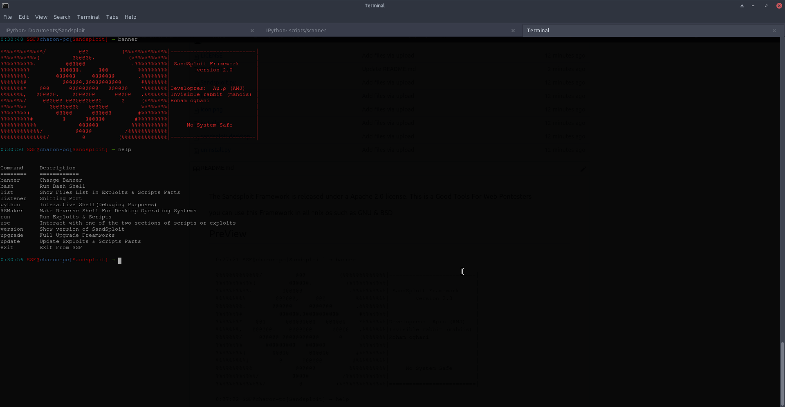

The Sandsploit Framework is released under a Apache 2.0 license.
This is a Good Tools For Web Pentesters

you can use this Framework in all *nix os such as GNU & BSD
## PreView
<pre>
0:27:21 SSF@charon-pc[Sandsploit] → banner
 
%%%%%%%%%%%%%/          @@@          (%%%%%%%%%%%%%|==========================|
%%%%%%%%%%%(          @@@@@@,          (%%%%%%%%%%%|                          |
%%%%%%%%%%.         @@@@@@              .%%%%%%%%%%| SandSploit Framework     |
%%%%%%%%%         @@@@@@,     @@@         %%%%%%%%%|        version 2.0       |
%%%%%%%%.        @@@@@@     @@@@@@@       .%%%%%%%%|                          |
%%%%%%%#           @@@@@@,@@@@@@@@@@@      #%%%%%%%|                          |
%%%%%%%*    @@@      @@@@@@@@@   @@@@@@    *%%%%%%%|Developres:  Aμιρ (AMJ)   |
%%%%%%%,   @@@@@@.    @@@@@@@      @@@@@   ,%%%%%%%|Invisible rabbit (mahdis) |
%%%%%%%/     @@@@@@ @@@@@@@@@@@      @     (%%%%%%%|Roham oghani              |
%%%%%%%%       @@@@@@@@@   @@@@@@          %%%%%%%%|                          |
%%%%%%%%(        @@@@@      @@@@@@        #%%%%%%%%|                          |
%%%%%%%%%#         @      @@@@@@         #%%%%%%%%%|                          |
%%%%%%%%%%%             @@@@@@          %%%%%%%%%%%|     No System Safe       |
%%%%%%%%%%%%/          @@@@@          /%%%%%%%%%%%%|                          |
%%%%%%%%%%%%%%/          @          (%%%%%%%%%%%%%%|==========================|
    
0:27:22 SSF@charon-pc[Sandsploit] → help

Command     Description
========    ============
banner      Change Banner
bash        Run Bash Shell
list        Show Files List In Exploits & Scripts Parts
listener    Sniffing Port
python      Interactive Shell(Debuging Purposes)
RSMaker     Make Reverse Shell For Desktop Operating Systems
run         Run Exploits & Scripts
use         Interact with one of the two sections of scripts or exploits
version     Show version of SandSploit
upgrade     Full Upgrade Freamworks
update      Update Exploits & Scripts Parts
exit        Exit From SSF
                
0:27:25 SSF@charon-pc[Sandsploit] → 

</pre>
Screenshot
--

Installing
--

For Install The Sandsploit Framework you must run installer.py with Python interpreter

Using Sandsploit
--
To run the Sandsploit after installing it, run the sandsploit command on the terminal
You can use one of the two sections of exploits or scripts with run command

such as run scripts

You will also be shown a list of commands by entering the "help" command

