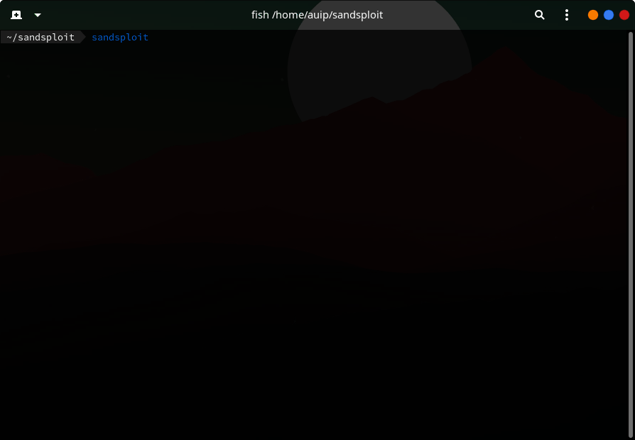

[](https://www.python.org/)
[](https://gitHub.com/auip-0x0/)


The Sandsploit Framework is released under a 

This is a Good Tool For Pentesters

you can use this Framework in all *nix os such as GNU & BSD
## PreView
<p align="center">
  
</p>

Installing
--

For Install The Sandsploit Framework you must run `setup.py` with Python interpreter

Using Sandsploit
--
Working with this tool is easy....

To get started,Run `sandsploit` in terminal


You can create a reverse shell with the command "RSMaker"
You can also use the tools we provide
<pre>
[SSF@AMJ](Sandsploit){None} → use Cracking
[SSF@AMJ](Sandsploit){Cracking} → list

Tools
===============
Hash_Cracker.py
WPCracker.py
FTPBruteForce.py
Gmail-Cracker.py

</pre>
You will also be shown a list of commands by entering the "help" command

Usable Sections
--
```
InformationGathering
Cracking
```
